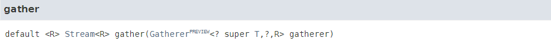
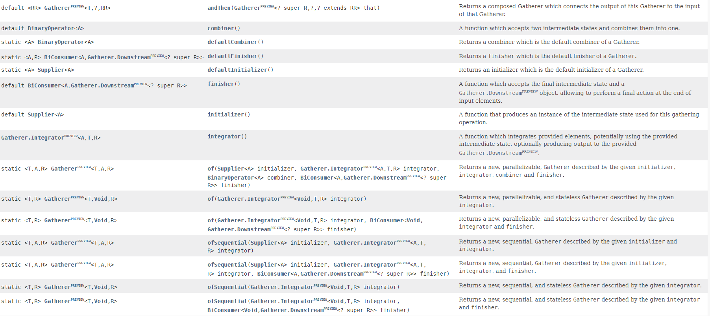
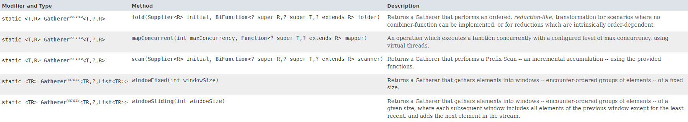

<!--
headingDivider: 1
-->

# JEP 473: Stream Gatherers (Second Preview)

金森　木綿子

# 自己紹介

- 金森　木綿子（`mumian1014`）

* 株式会社 NTTPC コミュニケーションズ

  - 新橋にある会社で~~飲酒駆動~~開発
    - Java, Ruby on Rails, Next.js, TypeScript

* 趣味：飲酒
  - 無類の焼酎好き


# 今日話すこと

JEP 473: Stream Gatherers (`Second` Preview)
https://openjdk.org/jeps/473

# Stream Gatherers

- Java22 では JEP461 にて Preview 機能として提案された。

  - https://openjdk.org/jeps/461
    - API 自体に変化はなく、23 にて再プレビュー。

- Stream API を強化し、カスタム中間操作をサポート。
  - 既存の組み込み中間操作では容易に実現できない方法でデータを変換できるようになる。

# Stream

- Java8 ではじめて導入された。

```
long numberOfWords =
    Stream.of("the", "", "fox", "jumps", "over", "the", "", "dog")  // (1)
          .filter(Predicate.not(String::isEmpty))                   // (2)
          .collect(Collectors.counting());                          // (3)
// numberOfWords ==> 6
```

(1) ストリームは作成するが、評価はしない
(2) `中間操作`を設定するが、評価はしない。
(3) 終端操作でストリーム・パイプラインを評価。

---

- Stream の中間操作と末端操作
  - 中間操作
    - `parallel`, `sequential`, `unordered`, `onClose`
    - `filter`, `map`, `flatMap`, `peek`
    - `distinct`, `sorted`, `limit`, `skip`
  - 末端操作
    - `close`, `iterator`, `forEach`, `collect`, `anyMatch`, `findFirst` ...

> それなりの中間操作は用意されているものの、一部の複雑なタスクはストリーム・パイプラインとして簡単に表現できない。

---

- 文字列の長さの重複を除く例

  - こうやって書けたら直感的でいいなぁ（かけない）

  ```
  var result = Stream.of("foo", "bar", "baz", "quux")
                     .distinctBy(String::length) // 組み込みに存在しないのでエラーになる
                     .toList();
  // result ==> [foo, quux]
  ```

---

- ありものでなんとか

```
record DistinctByLength(String str) {

    @Override public boolean equals(Object obj) {
        return obj instanceof DistinctByLength(String other)
               && str.length() == other.length();
    }

    @Override public int hashCode() {
        return str == null ? 0 : Integer.hashCode(str.length());
    }
}
```

```
var result = Stream.of("foo", "bar", "baz", "quux")
                   .map(DistinctByLength::new)
                   .distinct()
                   .map(DistinctByLength::str)
                   .toList();
// result ==> [foo, quux]
```

> 2 つのマッピング、distinct の実行…複雑…

# Gatherers

- Gatherers でできること。
  - 1 対 1、1 対多、多対 1、または多対多の方法で要素を変換。
  - 以前に確認した要素を追跡して、後の要素の変換に影響を与える。
  - 短絡、または入力要素の処理を停止して、無限ストリームを有限ストリームに変換。
  - 並列実行を可能にする。

---

- `java.util.stream.Stream`

  - Gatherers を引数に取る gather() が追加
    

  - `src/java.base/share/classes/java/util/stream/Stream.java`

    ```
    @PreviewFeature(feature = PreviewFeature.Feature.STREAM_GATHERERS)
    default <R> Stream<R> gather(Gatherer<? super T, ?, R> gatherer) {
        return StreamSupport.stream(spliterator(), isParallel())
                            .gather(gatherer)
                            .onClose(this::close);
    }
    ```

---

- `java.util.stream.Gatherer`
  

---

- `src/java/base/share/classes/java/util/stream/Gatherer.java`

  ```
  @PreviewFeature(feature = PreviewFeature.Feature.STREAM_GATHERERS)
  public interface Gatherer<T, A, R> {
      // 新しい、変更可能な状態の作成
      default Supplier<A> initializer() { return defaultInitializer(); };
      // 新しい入力要素の統合
      Integrator<A, T, R> integrator();
      // 2つの状態を1つに結合
      default BinaryOperator<A> combiner() { return defaultCombiner(); }
      // オプションの最終アクションの実行
      default BiConsumer<A, Downstream<? super R>> finisher() { return defaultFinisher(); }
    ...
  }
  ```

---

- p.8 よ再び…

```
Gatherer<String, Set<Integer>, String> distinctByLength =
  Gatherer.ofSequential(

    HashSet::new,

    (state, element, downstream) -> {
      var added = state.add(element.length());
      return added ? downstream.push(element)
                   : !downstream.isRejecting();
    },

    Gatherer.defaultFinisher()
  );

```

```
  var result = Stream.of("foo", "bar", "baz", "quux")
                     .gather(distinctByLength)
                     .toList();
  // result ==> [foo, quux]
```

# built-in

- `java.util.stream.Gatherers`
  

---

- fold

  - 集約を段階的に構築し、入力要素が存在しなくなったときにその集約を発行するステートフルな多対 1 ギャザラー

  ```
  Stream.of(1, 2, 3, 4, 5)
        .gather(Gatherers.fold(() -> 1, (a, b) -> a * b))
        .toList();
  // [120]
  ```

---

- mapConcurrent

  - Virtual Thread を使用して、最大同時実行数の固定ウィンドウで操作を同時に実行するステートフルな 1 対 1 ギャザラー

  ```
  Stream.of(1, 2, 3, 4, 5)
        .gather(Gatherers.mapConcurrent(4, a -> a * 2))
        .toList();
  // [2, 4, 6, 8, 10]
  ```

---

- scan

  - 指定された関数を現在の状態と現在の要素に適用して次の要素を生成し、それを下流に渡すステートフルな 1 対 1 ギャザラー

  ```
  Stream.of(1, 2, 3, 4, 5)
        .gather(Gatherers.scan(() -> 1, (a,b) -> a * b))
        .toList();
  // [1, 2, 6, 24, 120]

  ```

---

- windowFixed

  - 入力要素を指定されたサイズのリストにグループ化し、ウィンドウがいっぱいになったときに下流にウィンドウを発行するステートフルな多対多ギャザラー

  ```
  Stream.of(1, 2, 3, 4, 5)
        .gather(Gatherers.windowFixed(2))
        .toList();
  // [[1, 2], [3, 4], [5]]
  ```

---

- windowSliding

  - 入力要素を指定されたサイズのリストにグループ化するステートフルな多対多のギャザラー

  ```
  Stream.of(1, 2, 3, 4, 5)
        .gather(Gatherers.windowSliding(2))
        .toList();
  // [[1, 2], [2, 3], [3, 4], [4, 5]]
  ```

# Custom

```
import java.util.function.Function;
import java.util.stream.Gatherer;

class MapNotNullGatherer<T,M> implements Gatherer<T, T, M> {
    private final Function<T, M> mapper;

    public MapNotNullGatherer(Function<T, M> mapper) {
        this.mapper = mapper;
    }

    @Override
    public Integrator<T, T, M> integrator() {
        return Integrator.ofGreedy((_, item, downstream) -> {
            if(item != null) {
                downstream.push(mapper.apply(item));
            }
            return true;
        });
    }
}
```

---

```
import java.util.Map;
import java.util.Set;
import java.util.function.BiFunction;
import java.util.function.Function;
import java.util.function.Predicate;
import java.util.stream.Gatherer;

public class MyGatherers {

    public static <T, M> Gatherer<T, T, M> mapNotNull(Function<T, M> mapper) {
        return new MapNotNullGatherer<>(mapper);
    }

}
```

```
import java.math.BigDecimal;

public record Snack(String name, BigDecimal amount) {
    public Snack multiply(BigDecimal multiplier) {
         return new Snack(name, amount.multiply(multiplier));
    }
}
```

---

```
public void main() {
    var snack = Arrays.asList(
		    new Snack("うまい棒", BigDecimal.valueOf(10)),
		    null,
		    new Snack("ブタメン", BigDecimal.valueOf(70)),
		    new Snack("やまとの味カレー", BigDecimal.valueOf(20)),
		    null,
		    null,
		    null
	);

  var withTax = new BigDecimal("1.1");
	snack.stream()
            .gather(MyGatherers.mapNotNull(s -> s.multiply(withTax)))
            .forEach(System.out::println);
  // Snack[name=うまい棒, amount=11.0]
  // Snack[name=ブタメン, amount=77.0]
  // Snack[name=やまとの味カレー, amount=22.0]
}
```

# 最後に

- 紹介した機能は一部に過ぎませんが、JDK24 で正式リリースになると思うので、リリース前に確認しておくと良いと思います。
